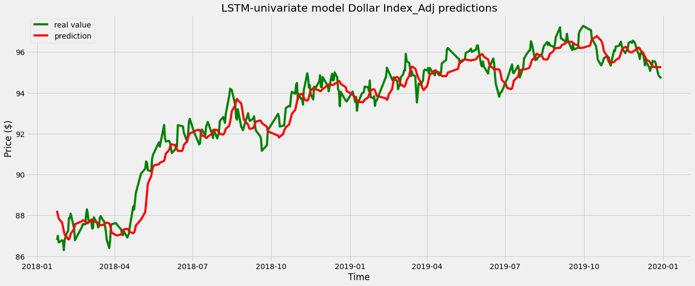

# Time-Series-Predicter

 <div align="center">
  <h3>Forecasting time series data with machine and deep learning techniques</h3>
  
  
  <a href="https://github.com/noaahhh/Time-Series-Predicter/issues"></a>
  <a href="https://github.com/noaahhh/Time-Series-Predicter/issues/stargazers"></a>
  <a href="https://github.com/noaahhh/Time-Series-Predicter/issues/blob/main/LICENSE"></a>
</div>

# About
This project aims to how to forecast a financial time series data using machine and deep learning techniques. Using this knowledge, I want to create an project which can predict next values of financial datas.  Tecnical analysis notebook contains different indicator for BTC-TRY prices.

LSTM univariate models can forecast DXY and Gold ounce price using own old data. 

LSTM multivariate models forecast DXY ann Gold ounce price with many financial time series, multi input and one output is used. 

C-LSTM models is the version of multivariate models that added convolitional and pooling layer. 

# Installation
For two ipynb , you can download latest version of imported library at the beginning of notebook for both.
``` sh 
keras-latest
tensorflow-latest
matplotlib-latest
```

for installation you can use:
``` sh
pip3 install keras  matplotlib tensorflow --upgrade 
```


# Related link
 
 You can see the gist these link:

[TechnicalAnalysis](https://gist.github.com/noaahhh/b96d769ea9339f261974d8b5e100a492)

[timeSeriesPredicter](https://gist.github.com/noaahhh/f0d180f3023ac083c9b1c5478f3b1d4c)


